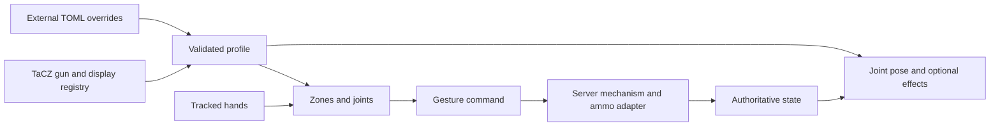

# Proposed profile architecture: parts, joints, mechanisms and persistent poses

Status: experimental profile design with an offline TOML validator. Branch `codex/data-driven-gun-profiles`, based on committed 0.11.0 checkpoint `3638343`. Update: an executable subset now migrates all 18 existing physical profiles and adds SCAR-L/H behind a Legacy/TOML switch. See [runtime scope and setup](RUNTIME-PROFILES.md); the richer schema below remains a proposal. A separate opt-in Advanced Handling ownership experiment is now implemented in 0.12.0-alpha.1; see its release notes for limits.

## Recommendation

Use a hybrid: mechanism templates implement authoritative rules; named parts and constrained joints define how a particular gun is manipulated/rendered; zones bind controller gestures to allowed mechanism commands. State drives persistent poses. Optional short animations/sounds decorate successful transitions but never commit ammunition.

This keeps the user's proposed file-authoring workflow while separating physical movement from game rules. Another conventional magazine pistol should require only a descriptor and calibration. A plasma cartridge that fills several charges, a dual-chamber weapon, or a new reload sequence may need a new tested adapter/template.

| Option | Authoring | Correctness / maintenance | Decision |
| --- | --- | --- | --- |
| Parts plus animation/action arrays only | Small initially | Cannot distinguish a held-open action from an animation, or define safe ammo changes | Insufficient by itself |
| Fully programmable per-gun state machine | Most expressive | Every author must get ammo commits, interruptions and synchronization right; creates another scripting runtime beside TaCZ | Defer as an advanced extension |
| Named parts + joints + mechanism templates + optional guarded transitions | Simple common cases; explicit unusual behavior | Shared ammo invariants and predictable validation; new primitives sometimes need code | Recommended |

## Evidence from the supplied packs

The read-only inventory is `experiments/profile-v1/pack-inspection.json`. These are source observations, not in-game passes.

- Immersive Armorer folder contains **13 gun index entries**, despite the older website description saying ten. Project Zero contains **14 index entries**; one, `project_zero:makarov`, references a missing `makarov_data.json` in the supplied folder.
- All resolved models in this inspection have third-person hand and muzzle markers. Several lack a `shell` marker. Missing cosmetic ejection must not block button support.
- Immersive pistol `slide` parents `main_slide`; its GLTF `shoot` channels target `slide`. Move the parent once. A numeric array with two independent motions would be easy to double-apply.
- Project Zero FAMAS uses `magazine2`, not `magazine`; USP has `slide_main`/`slide_main2`. Semantic aliases should point to actual nodes, not impose fixed node names or indices.
- Immersive animations include GLTF as well as Bedrock animation JSON. Support detection cannot require `.animation.json`; the runtime should resolve TaCZ-loaded assets.
- Chemical thrower uses a `fuel` reload. Plasma gun's script clears existing charge then consumes ONE inventory item to fill maximum ammo, with additional custom shooting behavior. The ordinary one-item-per-round adapter would be wrong.
- Double shotgun's Lua branches on ammo-count parity during shooting. Dual-barrel cannon uses its own reload script and treats ammo >= 6 as tactical. Copying generic Glock ammo rules would ignore these contracts.
- Project Zero folder name targets 1.21.1; our runtime is 1.20.1. Metadata similarity is not version compatibility.
- Inspection found literal `flase` in chemical thrower display and `0.` in FAT data. The offline scanner records its lenient reading; it does not alter source assets or prove TaCZ can load them.

Useful references relative to the supplied pack roots:

- Immersive: `data/immersive_armorer/scripts/plasma_gun_logic.lua`, `double_shotgun_logic.lua`, `dual_barrel_cannon_logic.lua`.
- Immersive: `assets/immersive_armorer/geo_models/gun/pistol_9mm_geo.json`, `animations/pistol_9mm.gltf`.
- Project Zero: `assets/project_zero/geo_models/gun/famas_geo.json`, `data/project_zero/index/guns/makarov.json`.

## How the proposed fields change

| Original idea | Proposed representation | Reason |
| --- | --- | --- |
| `tacz_namespace` + gun name | `id = "namespace:gun"` plus `display` | Matches TaCZ resource identity; one gun can have alternate geometry |
| `base_model` | `model = "tacz_resolved_display"`, with optional explicit override later | Reuse the model and textures already loaded by TaCZ |
| `magazine_model`, `charger_model` | Named `parts.magazine`, `parts.slide`, `parts.handle` pointing to model nodes | Usually subtrees of one model, not separate model files |
| Bullet model | Explicit source such as `native_ammo_shell` or named model node | A chamber cartridge, projectile entity and spent case are different visuals |
| Indexed extra models | Arbitrary named parts, e.g. `belt`, `cover`, `battery`, `safety` | Adding/reordering a part cannot silently redirect an animation |
| Movement restriction arrays | Named prismatic/revolute joints, axes, pivots, bounds and return policy | Describes both controller motion and model movement |
| Colored boxes | Named zones with explicit frame, position, dimensions, part and optional followed joint | Colors are hints, not gameplay identity; same geometry is used for detection and guides |
| Actions / states | Mechanism commands, guarded transitions and state pose rules | Keeps model motion from independently consuming/chambering ammo |

TOML is a good author format: comments, named tables and arrays of tables suit hand editing. Parse it into a typed internal descriptor; normalize/hash that for network synchronization. Prefer one gun per file, but allow `[[guns]]` for a small pack. Do not use `[[gun_pack]]` to ambiguously mean both the pack and one gun.

## Layers and ownership

1. **Geometry/parts:** TaCZ resource references and semantic aliases. Resolve the complete bone hierarchy; bind pose must not depend on whichever desktop animation happened to run this frame.
2. **Joints:** prismatic translation or revolute rotation. Use logical gun-space metres/degrees, then convert once to model-local transforms. `frame` is explicit; do not mix model pixels, gun calibration offsets and world metres. Angular joints need a pivot. Later multi-axis assemblies use explicit ordered composition.
3. **Mechanism state:** magazine presence, action position/lock, chamber status, obstruction state and optional support-hand ownership. Avoid one enormous enum containing every combination. Shared components maintain compatible facts and derived allowed actions.
4. **Gesture bindings:** grab/release, joint endpoint, sweep/slap, touch or insertion -> approved mechanism command. Bindings cannot directly set native ammo or damage. Zones that follow a part must follow the same solved transform on client/server, so highlights and actual hit tests agree.
5. **Presentation:** joint pose from state, plus optional transient visual/sound effects. Rendered interpolation is cosmetic; server committed state and thresholds decide feeding/ejection.

### Locked-open slide example

`shot committed` -> mechanism observes empty condition -> `action.locked_open = true` -> pose solver holds slide joint at its rear limit. No empty-shot animation needs to keep playing.

When a replacement magazine is inserted, the gun remains locked open. A release control or accepted full rack asks the mechanism to close. The server checks ammo/jam/action rules, commits at most one feed, clears the lock, and publishes the result. A spring animation can then show the slide closing. The visual animation ending never creates a round.

While the hand is actively holding the slide, the constrained joint follows the hand unless an interlock forbids it. Recommended pose precedence: mechanism interlocks, then held motion, then spring/rest. Threshold hysteresis re-arms endpoint events only after the return stroke. On release, `spring` returns and `hold` stays; whether returning feeds is still a mechanism decision.

### Input ownership: preserve Visor hotbar switching

Grip means Visor's normal hotbar/Grip action, not a new addon-only modifier. The latest holster-based design supersedes the earlier Grip + Use hotbar proposal: Grip at an eligible gun/part grabs it; a free-hand Grip elsewhere belongs to Visor. While carrying a gun, Use invokes its contextual action even though Grip remains held. The user frees Grip by holstering or releasing the gun. Advanced Handling is opt-in; legacy controls remain available.

Input arbitration belongs above per-gun profiles. A press chooses an owner and retains it through release. During an airborne catch only, Grip can open a provisional radial for a configurable grace window without starting Visor's slot-changing task. A catch closes the preview; expiry hands the press to Visor. Once handed over, later gun motion cannot steal it. Inspection uses release-Grip-then-Use within a separate grace window, with Use/Trigger release latches on returning to the firing hold. Focus loss, tracking loss and slot changes cancel pending gestures rather than synthesizing fresh button actions.

Grabbing remains contextual to an eligible gun/part/zone. Outside that context, preserve normal Visor interactions. Input ownership and two-handed support policy are separate from the gun's ammo mechanism.

### Existing mechanism vs new logic

For conventional pistols: same `closed_bolt_magazine` engine, different part aliases, joints, regions and sounds. Open-bolt magazines need a distinct engine. Pump, lifted bolt and cylinder/breech retain separate validated templates.

For unusual packs: an ammo adapter can explicitly represent `one_inventory_item_fills_charge`, or preserve a known native scripted reload contract. Generic `tacz_base_action = reload` is only an end-to-end button operation; it is not a safe partial physical feed callback. Do not let native scripted feed and physical feed both run.

A future restricted transition table can compose known operations (unlock, reach rear, eject, reach forward, feed) with guards and cycle IDs. It must not allow arbitrary expressions, unrestricted NBT writes or raw ammo deltas. Add this only when concrete mechanisms cannot be expressed with template parameters; the offline examples intentionally do not implement a new state-machine language.

## Persistence, reload and removal

- Native TaCZ ammo remains authoritative. Store only necessary physical state/reservation metadata, with a schema version. Do not persist controller poses, active grabs or interpolation progress.
- A transition commits ammo exactly once per action cycle. Repeated network delivery, endpoint jitter and reconnect must not duplicate the commit. Client prediction never consumes inventory.
- A profile reload first validates the whole candidate set. Cancel previews, settle old reservations with the OLD engine, then switch profiles atomically at a safe boundary and synchronize revision hashes. Keep the old set if validation fails.
- Missing models/parts disable physical capability for that descriptor. If basic geometry is valid, fall back to native button handling with an explicit reason. If basic geometry is also missing, request calibration/override instead of claiming muzzle alignment.
- Old user calibration remains an override layer, retaining its actual numbers. Migrating to part-relative zones needs an explicit conversion, not silently reinterpreting old gun-space offsets.
- Server owns gameplay profiles. Pack client render assets cannot be loaded on dedicated servers; extract normalized descriptors or implement a bounded geometry exchange. Profiles from both sides need compatible identity/revision before physical activation.
- Removing the addon should leave native ammo usable. A new adapter must specify how reserved ammunition is restored/settled before release; no new mechanism is considered complete without this test.

## Loading and automatic discovery

Proposed precedence: shipped profile < pack-provided descriptor < administrator override; personal calibration is separate. Keep full `gun|display` identity. Suggested future user directory: `config/visor_tacz/profiles/`; not implemented yet. Data pack/resource pack transport is also possible after dedicated-server ownership is settled.

At runtime discover TaCZ's loaded registry/display objects after resource loading. Infer only basic button geometry from resolved bind-pose paths, recording missing markers. Never infer physical capability from `type`, `bolt`, or matching bone names alone. Custom gameplay scripts, fuel semantics and uncommon actions require a known adapter. Reload removes stale profiles and resyncs observers.

Offline ZIP inspection is useful for author tooling and reports. It does not replace TaCZ resource resolution, and must not execute scripts or modify packs. Support wrappers inside ZIPs and namespaces from resource IDs rather than assuming the filename is the namespace.

## Smallest useful experiment and migration

1. **Done on this branch:** inspect supplied packs, draft two TOML examples, offline validation for IDs/references/joint bounds/zone fields/approved commands, negative tests, folder/ZIP inventory. No live profiles activated.
2. Next: typed common-side descriptor plus external loading, report-only mode, and model-reference diagnostics. Prove a dedicated server can load the descriptor without renderer classes.
3. Migrate ONE already-supported Glock profile, keeping its state/ammo engine unchanged. Compare resulting geometry/poses and all existing calibration values against 0.11.0. Add reload/reconnect tests before removing its legacy mapping.
4. Register Immersive pistol in button mode from actual loaded assets, then opt its descriptor into the same validated pistol engine. Test FAMAS mapping separately; first resolve Project Zero version compatibility.
5. Add revolute/multi-stage M700, pump, and cylinder adapters incrementally. Replace each hard-coded mapping only after parity. Avoid maintaining two engines for one active gun.
6. Address fuel and custom-script weapons with explicit adapters and tests. Do not automatically route plasma/double-shotgun guns through conventional magazine logic.

Success means a user can edit node names/axes/zones, reload a profile and see changed handling without recompiling, while unchanged profiles retain ammo counts, remote poses, calibration and rollback behavior. The current offline prototype demonstrates authoring/validation only; it does not yet satisfy that runtime milestone.
